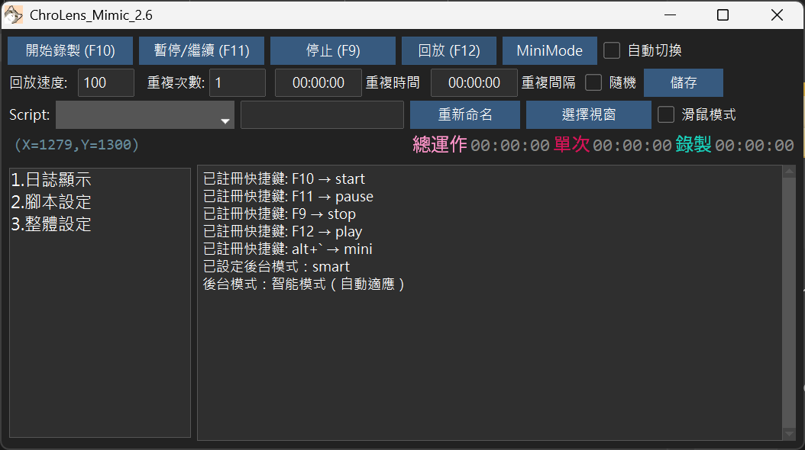
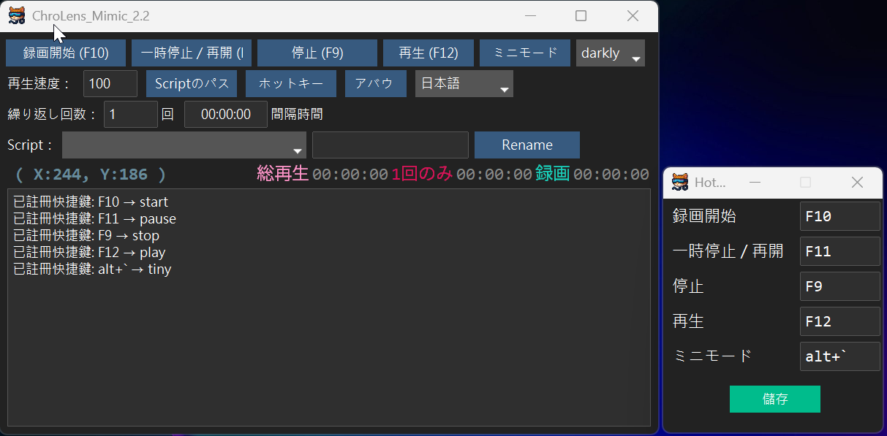
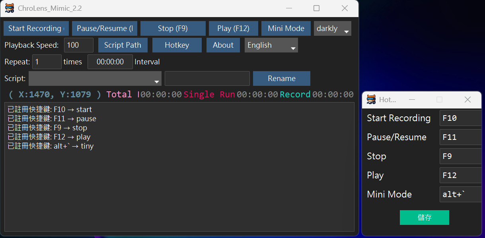

<!-- Microsoft Clarity Analytics -->

<!-- End Microsoft Clarity Analytics -->

## 功能介紹： 
1.巨集錄製工具：可以錄製鍵盤和滑鼠的所有操作，並將其儲存為巨集。 
2.設定重複的次數或是指定的時間範圍進行重複 
3.可自定義快捷鍵、腳本名稱、Skin 

### 情境範例： 
1.數筆excel表格內容複製到資料庫貼上 
2.滑鼠左右滑動，預防電腦進入待機或登入畫面 
3.遊戲重複操作：定點採集/簡單左右移動/重複施放技能 

---
# [ChroLens Project](https://home.gamer.com.tw/artwork.php?sn=6150515) 

---

### 💸 支持作者 / Support the Creator / 作者を応援する💸
 
 **這些程式幫你省下的時間，分一點來抖內吧！給我錢錢！**   
 **These scripts saved you time—share a bit and donate. Give me money!**     
 **このツールで浮いた時間、ちょっとだけ投げ銭して？お金ちょうだい！**   

👉如果你有任何問題、想法或建議，請加入我的 [Discord ChroLens](https://discord.gg/72Kbs4WPPn)

📖 **[查看完整指令說明文件](https://lucienwooo.github.io/ChroLens_Mimic/)** | [View Full Documentation](https://lucienwooo.github.io/ChroLens_Mimic/) | [完全なドキュメントを見る](https://lucienwooo.github.io/ChroLens_Mimic/)

---

## 🇯🇵 日本語の紹介

**ChroLens_Mimic** は、Windows 上のマウス・キーボードの操作を滑らかかつシンプルに記録・再生できる **“マクロ録画＆再生ツール”** です。  
**TinyTask** や **AutoHotkey（AHK）のレコーディング機能** に似た使いやすさを目指していて、プログラミング不要で、単純な繰り返し作業から軽度の自動化まで幅広く活用できます。

特にゲーマーの定番である TinyTask の直感的な操作性や、AHK のようにホットキーだけで起動・停止できる便利さが、ChroLens_Mimic の強みです。  
使い方は録画開始（Record）→停止（Stop）→再生（Play）、繰り返し指定、ホットキー設定も可能。

GitHub にて v2.2 を公開中。詳細やダウンロード、質問はこちらのリポジトリを参照してください。

---

## 🇺🇸 English Introduction

**ChroLens_Mimic** is a lightweight macro recorder for Windows that lets you record and replay mouse and keyboard actions—much like **TinyTask** or AutoHotkey’s built-in macro recorder.  
Aimed at users who want no‑code automation, ChroLens_Mimic combines TinyTask’s simplicity (just record → stop → play) with AutoHotkey’s hotkey‑based control.

You can loop playback, assign hotkeys, and save your macros for everyday automation tasks—whether for work or casual use.  
If you're familiar with TinyTask’s one‑click simplicity or AHK’s scripting flexibility, you'll find ChroLens_Mimic a natural fit for reducing repetitive tasks.

Check out the GitHub repository (v2.2 available) for download, documentation, and support.