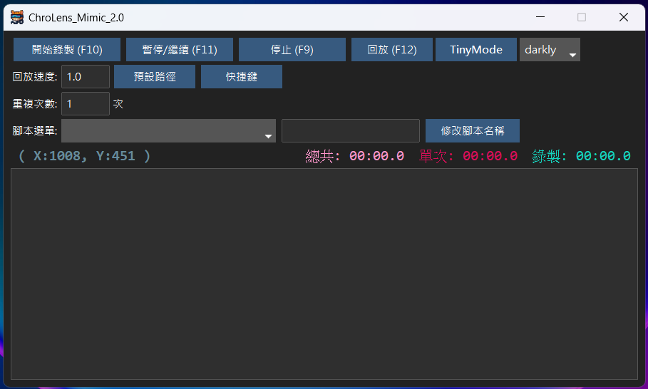

# ChroLens Project 
## [ChroLens_Portal v2.0](https://github.com/Lucienwooo/ChroLens_Portal)批次開關分組的檔案、快捷鍵切換複數視窗。 
## [ChroLens_Mimic v2.0](https://github.com/Lucienwooo/ChroLens_Mimic) 巨集錄製工具、鍵鼠模擬、按鍵精靈。 
## [ChroLens_Clear v1.0](https://github.com/Lucienwooo/ChroLens_Clear) 自動關閉複數視窗/程式 
 
預計開發：
1.自訂系統排成工具：更簡便和直覺的方式去設定Windows的工作排成器，可能再新增別的個人化功能，定時開啟/關閉某些程式

---
#### 📄 授權資訊 (Licensing) 
本專案的程式碼依循 GNU General Public License v3.0 (GPLv3) 發布。這表示你可以自由地使用、學習、修改及分發本程式碼，但請務必遵守該許可證的所有條款。  
如果你希望將本程式碼用於閉源專案、商業販售，或需要專門的商業支援服務，請聯繫。  
詳情請參閱專案根目錄下的 [LICENSE 檔案](LICENSE)。 
---
#### 📄 免責聲明 
此程式碼僅供一般參考及用途。作者不對因使用或無法使用此程式碼所造成的任何損害承擔責任。使用本程式碼的風險由使用者自行承擔。 
---
### 💰 支持作者 / Support the Creator / 作者を応援する
💸💸
 **這些程式幫你省下的時間，分一點來抖內吧！給我錢錢！**   
 **These scripts saved you time—share a bit and donate. Give me money!**     
 **このツールで浮いた時間、ちょっとだけ投げ銭して？お金ちょうだい！**   

👉如果你有任何問題、想法或建議，請加入我的 [Discord－ChroLens](https://discord.gg/72Kbs4WPPn)
