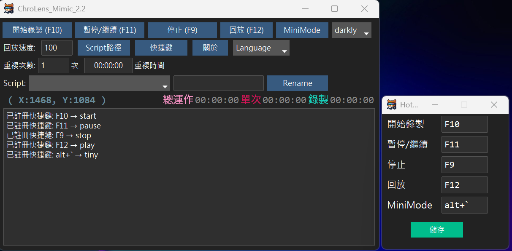

## 功能介紹： 
1.巨集錄製工具：可以錄製鍵盤和滑鼠的所有操作，並將其儲存為巨集。 
2.設定重複的次數或是指定的時間範圍進行重複 
3.可自定義快捷鍵、腳本名稱、Skin 

### 情境範例： 
1.數筆excel表格內容複製到資料庫貼上 
2.滑鼠左右滑動，預防電腦進入待機或登入畫面 
3.遊戲重複操作：定點採集/簡單左右移動/重複施放技能 

---
# [ChroLens Project](https://home.gamer.com.tw/artwork.php?sn=6150515) 
## [ChroLens_Portal](https://github.com/Lucienwooo/ChroLens_Portal)_批次開關分組的檔案、快捷鍵切換複數視窗置頂顯示。 
## [ChroLens_Mimic](https://github.com/Lucienwooo/ChroLens_Mimic)_巨集錄製工具、鍵鼠模擬、按鍵精靈。 
## [ChroLens_Clear](https://github.com/Lucienwooo/ChroLens_Clear)_自動關閉複數視窗/程式 
## [ChroLens_Orbit](https://github.com/Lucienwooo/ChroLens_Orbit)_簡易版工作排程器，支援開啟捷徑.lnk檔案 
# [ChroLens_Sothoth](https://github.com/Lucienwooo/ChroLens_Sothoth)_建立在mimic之上，擁有模組化動作編輯以及圖片偵測的自動化工具 

---

### 💸 支持作者 / Support the Creator / 作者を応援する💸
 
 **這些程式幫你省下的時間，分一點來抖內吧！給我錢錢！**   
 **These scripts saved you time—share a bit and donate. Give me money!**     
 **このツールで浮いた時間、ちょっとだけ投げ銭して？お金ちょうだい！**   

👉如果你有任何問題、想法或建議，請加入我的 [Discord ChroLens](https://discord.gg/72Kbs4WPPn)

## 機能紹介：
1.  **マクロ記録ツール**：キーボードとマウスのすべての操作を記録し、マクロとして保存できます。
2.  **繰り返し回数または指定された時間範囲で繰り返しを設定**。
3.  **ホットキー、スクリプト名、スキンをカスタマイズ可能**。

### シナリオ例：
1.  複数のExcelシートの内容をコピーしてデータベースに貼り付け。
2.  マウスを左右に動かして、PCがスタンバイまたはログイン画面に入るのを防ぐ。
3.  ゲームの繰り返し操作：定点採集 / 簡単な左右移動 / スキル連発。

## Features:
1.  **Macro Recording Tool**: Records all keyboard and mouse operations and saves them as macros.
2.  **Set repetitions by count or within a specified time range**.
3.  **Customizable hotkeys, script names, and skins**.

### Use Cases:
1.  Copying content from multiple Excel sheets and pasting it into a database.
2.  Moving the mouse left and right to prevent the computer from entering standby or the login screen.
3.  Repetitive in-game actions: fixed-point gathering / simple left-right movement / repeated skill casting.