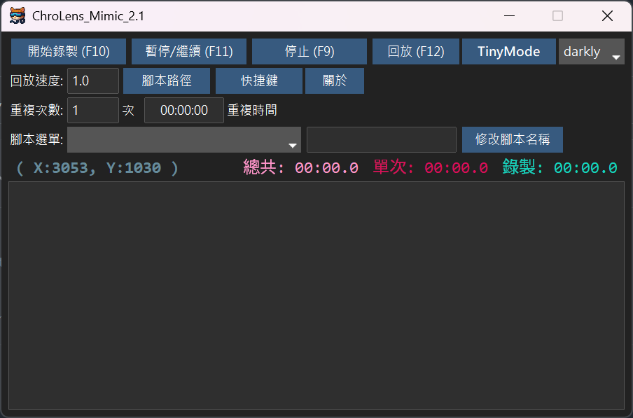

[中文版 (Chinese Version)](./README.md) | [日本語版 (Japanese Version)](./README_JA.md)

## Features:
1.  **Macro Recording Tool**: Records all keyboard and mouse operations and saves them as macros.
2.  **Set repetitions by count or within a specified time range**.
3.  **Customizable hotkeys, script names, and skins**.

### Use Cases:
1.  Copying content from multiple Excel sheets and pasting it into a database.
2.  Moving the mouse left and right to prevent the computer from entering standby or the login screen.
3.  Repetitive in-game actions: fixed-point gathering / simple left-right movement / repeated skill casting.

### Update Plan:
1.  Add Japanese and English versions.
2025.06.08

---

# ChroLens Project

## [ChroLens_Portal](https://github.com/Lucienwooo/ChroLens_Portal)
Batch opening/closing grouped files, hotkey switching for multiple windows to stay on top.

## [ChroLens_Mimic](https://github.com/Lucienwooo/ChroLens_Mimic)
Macro recording tool, keyboard/mouse simulation, auto-clicker/macro program.

## [ChroLens_Clear](https://github.com/Lucienwooo/ChroLens_Clear)
Automatically closes multiple windows/applications.

---

#### 📄 Licensing

The code for this project is released under the GNU General Public License v3.0 (GPLv3). This means you are free to use, study, modify, and distribute this code, but you must comply with all the terms of the license.

If you wish to use this code in a closed-source project, for commercial sale, or require dedicated commercial support services, please contact.

For details, please refer to the [LICENSE file](LICENSE) in the project root.

---

#### 📄 Disclaimer

This code is provided for general reference and use only. The author assumes no responsibility for any damages incurred from the use or inability to use this code. Use of this code is at the user's own risk.

---

### 💸 Support the Creator / 作者を応援する / 支持作者💸

These scripts saved you time—share a bit and donate. Give me money!
このツールで浮いた時間、ちょっとだけ投げ銭して？お金ちょうだい！
這些程式幫你省下的時間，分一點來抖內吧！給我錢錢！

👉 If you have any questions, ideas, or suggestions, please join my [Discord ChroLens](https://discord.gg/72Kbs4WPPn)