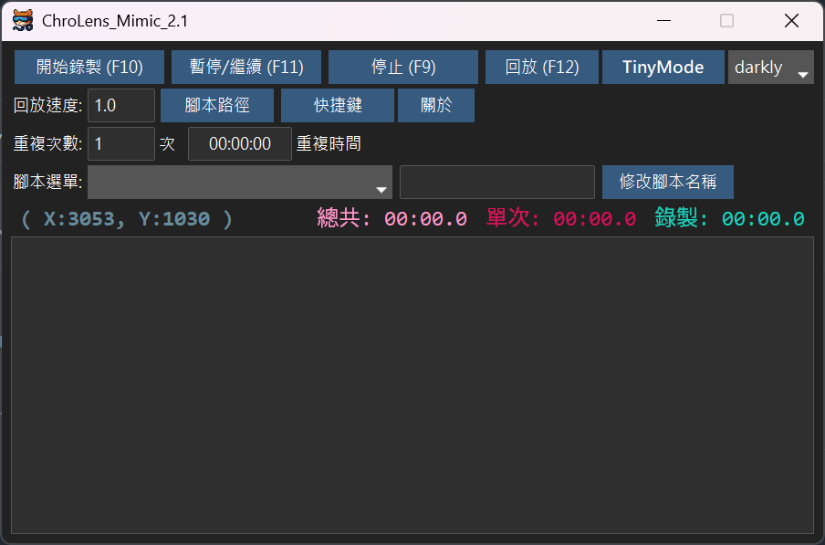

[中文](./README.md) | [English](./README_EN.md)

## 機能紹介：
1.  **マクロ記録ツール**：キーボードとマウスのすべての操作を記録し、マクロとして保存できます。
2.  **繰り返し回数または指定された時間範囲で繰り返しを設定**。
3.  **ホットキー、スクリプト名、スキンをカスタマイズ可能**。

### シナリオ例：
1.  複数のExcelシートの内容をコピーしてデータベースに貼り付け。
2.  マウスを左右に動かして、PCがスタンバイまたはログイン画面に入るのを防ぐ。
3.  ゲームの繰り返し操作：定点採集 / 簡単な左右移動 / スキル連発。

### 更新計画：
1.  日本語版、英語版を追加。
2025.06.08

---

# [ChroLens Project](https://home.gamer.com.tw/artwork.php?sn=6150515) 
## [ChroLens_Portal](https://github.com/Lucienwooo/ChroLens_Portal)
グループ化されたファイルのバッチ開閉、ホットキーによる複数ウィンドウの最前面表示切り替え。

## [ChroLens_Mimic](https://github.com/Lucienwooo/ChroLens_Mimic)
マクロ記録ツール、キーボード/マウスシミュレーション、オートクリッカー。

## [ChroLens_Clear](https://github.com/Lucienwooo/ChroLens_Clear)
複数ウィンドウ/アプリケーションの自動終了。

---

#### 📄 ライセンス

[LICENSE ファイル](LICENSE) を参照してください。

---

### 💸 サポートする / Support the Creator / 支持作者💸
 
このツールで浮いた時間、ちょっとだけ投げ銭して？お金ちょうだい！ 
These scripts saved you time—share a bit and donate. Give me money! 
這些程式幫你省下的時間，分一點來抖內吧！給我錢錢！ 
 
👉 ご質問、アイデア、ご提案がありましたら、私の [Discord ChroLens](https://discord.gg/72Kbs4WPPn) にご参加ください。